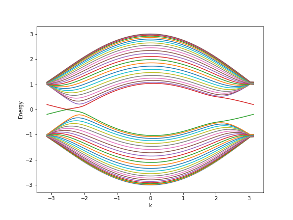

# Haldane Model Simulation 🧠
This repository contains a Python implementation of the **Haldane model** — a tight-binding model on a honeycomb lattice that exhibits a **quantum anomalous Hall effect (QAHE)** without an external magnetic field. The project allows you to explore topological properties of the system, such as the **energy band structure** and **Chern number**, by adjusting model parameters like on-site potential, hopping amplitudes, and phase factors.  
This code was created based on the theory presented [here](https://topocondmat.org/w4_haldane/haldane_model.html) and inspired by the tutorial from *Topological Condensed Matter Physics* (Topocondmat.org, 2025)

---

## 🧠 Features
- Compute and visualize **energy bands** of the Haldane model.  
- Calculate the **Chern number** using Berry curvature integration.  
- Adjustable parameters:
  - nearest- and next-nearest-neighbor hopping (`taa`, `tbb`, `tab`)
  - on-site potential difference (`M`)
- Option to display **edge states** for finite ribbons.  

---

## ⚙️ Installation
Clone this repository and move into the project directory:
```bash
git clone https://github.com/yourusername/haldane-model.git
cd haldane-model
```

Install all dependencies automatically:
```bash
pip install -r requirements.txt
```

If you prefer using a virtual environment (recommended):
```bash
python -m venv venv
source venv/bin/activate     # on Linux/macOS
venv\Scripts\activate        # on Windows
pip install -r requirements.txt
```

---

### 🧪 Alternative installation with conda
If you encounter issues installing **kwant** with `pip`, you can use **conda** instead:
```bash
conda create -n haldane python=3.11 numpy scipy matplotlib ipywidgets ipython notebook tinyarray kwant -c conda-forge
conda activate haldane
```
This will automatically install all dependencies, including precompiled binaries of `kwant`.

---

## 🚀 Usage
Open the Jupyter notebook:
```bash
jupyter notebook Haldane_graphene.ipynb
```

You can modify parameters directly in the notebook or script to explore different regimes of the model.

---

## 📊 Example Results
.png)  



---

## 🧪 Citation

If you use this code or its results in your work, please cite it as:

> Kacper Poluszejko, *Haldane Model Simulation*, GitHub repository, 2025.  
> Available at: [https://github.com/kacperpoluszejko/Haldane-model](https://github.com/kacperpoluszejko/Haldane-model)
  
The implementation was inspired by *"The Haldane Model"* tutorial from [Topocondmat.org](https://topocondmat.org/w4_haldane/haldane_model.html) (accessed October 2025).

---
 
## 📜 License
Licensed under the **MIT License**. See [LICENSE](LICENSE) for details.

